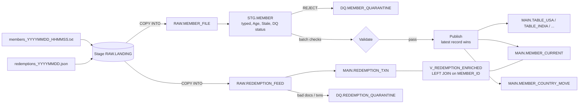

# Design notes

## Flow

One master procedure (`CTRL.SP_MASTER_LOAD`) runs every step in order.

## Schemas

| Schema | What's in it |
|---|---|
| RAW | Files exactly as received. All text for the member file, VARIANT for the JSON |
| STG | Current load only, typed and checked. Truncated at the start of each load |
| MAIN | Final data: the five country tables, MEMBER_CURRENT, the move history, redemptions |
| CTRL | Config (countries, code mapping, tiers, key-value settings) and the run logs |
| DQ | Quarantine: rows we couldn't load, with the reason |

## Decisions

**Raw is all text.** The brief's own staging sample shows what goes wrong otherwise: DOB lost its leading zero and Agent_Name went blank. Nothing is typed until staging, so a bad value can't fail the load or silently change on the way in.

**Member_Id is the key, not Member_Name.** Names repeat. Member_Id stays text, never a number, so an id with leading zeros can't change.

**Country tables come from config.** One template table, and a small proc creates one table per active row in `CTRL.COUNTRY_CONFIG`. Messy source values (PHIL, AU) go through a mapping table to one code. An unknown country goes to quarantine instead of creating a table. Adding a country is a config row, rerun the setup proc, then reprocess its quarantined rows.

**Latest record wins.**
- Across files: the date and time in the file name. There is no record level "updated at" in the file, and Last_Flight_Date is about flying, not profile changes.
- Same member twice in one file: the later flight date wins. If that's a tie with different values, both rows go to quarantine instead of guessing.
- A late, older file can't roll a member back. MEMBER_CURRENT keeps the file timestamp of the published version, and anything older is ignored.

**MEMBER_CURRENT.** One row per member with the country they're in now. It's how a move is detected with one lookup (instead of searching every country table), how late files are stopped, and what redemptions join to.

**SCD Type 1 plus a move log.** The country tables hold the current version only, which is what "latest record wins" asks for. Country changes are logged in `MEMBER_COUNTRY_MOVE` so that history isn't lost. If the business needed "which country was this member in on date X", I'd move to SCD Type 2 with valid from / to dates.

**Change detection.** Publish compares every winner with what's already published and skips rows where nothing changed. So LAST_UPDATE_DATE only moves on a real change, and an identical daily record doesn't touch the table.

**Age and Stale_Member as of the file date**, not today. Rerunning an old file gives the same answer. Stale is more than 90 days since the last flight, or since enrollment if the member hasn't flown. 90 comes from the key-value config.

**Redemptions.** Raw keeps the JSON document whole. The load checks the document, flattens `redemptions` into one row per transaction and MERGEs on txn_id, with the newer feed date winning so a status can move from PENDING to COMPLETED. The join to members is a LEFT JOIN: a redemption can arrive before its member, so it's kept and flagged as an orphan. MEMBER_CURRENT has one row per member, so the join never duplicates transactions.

**Validation, in layers.**
- Row level, in staging: mandatory fields, bad dates, unmapped country (reject); DOB leading zero, bad DOB, unknown tier (warn).
- Batch level, before publish: raw vs staging row count, values lost between raw and staging, reject rate, duplicate member ids. A failed ERROR check stops the run before anything is published.

**Orchestration.** The same pattern I used on a previous project: a process registry, load control, an execution log with insert / update / delete counts, and an error log. Each child proc takes the load id and returns its counts. On failure the error is logged and the run stops; the next run resumes the same load from the failed step. It runs serially.

**Audit columns.** Every table the pipeline writes has LOAD_ID and INSERT_DATE. Tables whose rows get updated also have LAST_UPDATE_DATE. File name and row number live in raw, staging and quarantine, so any row can be traced back to its source line through its load id.

## Who fixes what

- Bad data from the source (missing id, impossible date): the source team fixes and resends. The quarantine table has the file, line and reason.
- A config gap (new country, new tier): data engineering adds the config row and reprocesses the quarantined rows.
- A failed run: the error log has the step and the error; fix it and call the master again, and it resumes.

## At billions of rows a day

What I built runs the same logic; for real volume I'd change how it's triggered and sized:
- **Ingestion:** Snowpipe on the stage instead of a manual COPY, with files split to roughly 100 to 250 MB compressed so the load runs in parallel.
- **Incremental processing:** Streams on the raw tables and Tasks to run the steps, so each run only reads new rows. I've practised these but haven't used them on client work.
- **Publish:** the dedupe runs before the MERGE, so MERGE only ever sees one row per member. MEMBER_CURRENT clustered by country, redemptions by feed date.
- **Warehouses:** a separate warehouse for loading and for transforms, sized by run time.
- **Retention:** staging is transient; raw kept for a set number of days.

## Security (options I'd look at)

Masking policies on name and DOB, and a role per country so each team only sees its own table. A single member table with a row access policy is another option; it would make the country split a view instead of physical tables.

## What I'd do next

- Ask the source for a record level updated timestamp and the real file naming.
- A reprocess proc for quarantined rows once a config gap is fixed.
- An email alert on a failed run.
- Post Code, once the source starts sending it.
